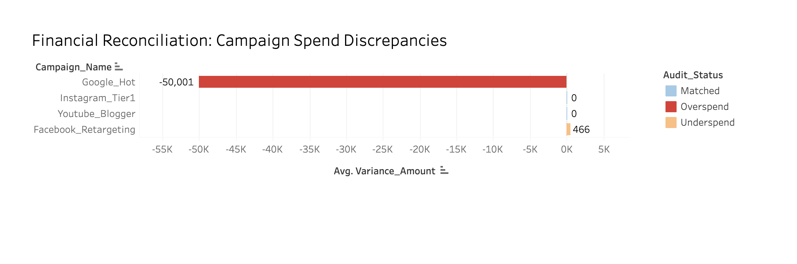

### 📌 Why I Built This
Working in media analysis, I've seen how easily platform data can drift from actual financial records. I created this project to move away from manual Excel checks and build a more robust, automated way to audit media spend. It’s not just about the numbers; it’s about making sure every pound we plan to spend is actually going where it’s supposed to.

### 🛠 How It Works
- **The Logic:** I used a `LEFT JOIN` in SQL to merge planned budgets with actual invoices, ensuring no campaign was missed even if an invoice hadn't arrived yet.
- **Automated Audit:** I wrote a `CASE WHEN` statement to instantly flag any discrepancy. This is how I identified the **-£50,001.24 variance** in the Google_Hot campaign.
- **Visual Visibility:** By visualizing these gaps in Tableau, I turned dry SQL tables into a clear "red-flag" report for stakeholders.

### 🔍 Technical Logic & Business Validation
- **Data Integrity:** Used SQL to handle null values and prevent data loss during the reconciliation process.
- **Actionable Visuals:** The chart highlights high-risk outliers, allowing the Finance team to focus on resolving specific overspend issues immediately.
